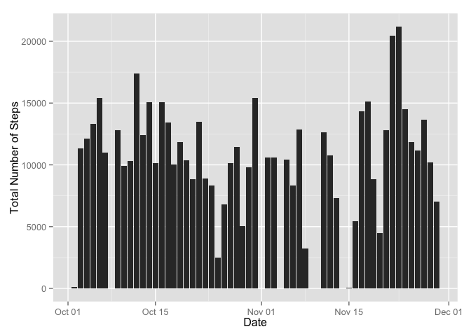
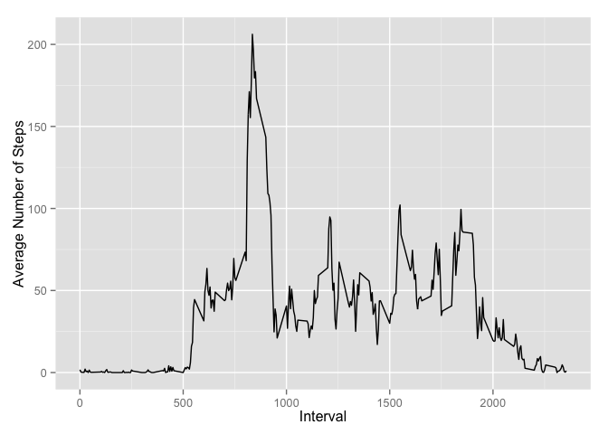
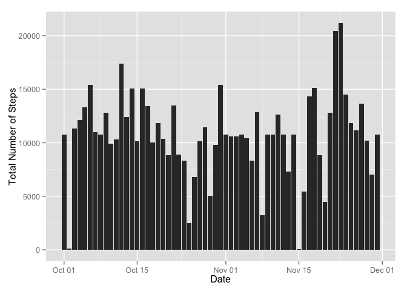
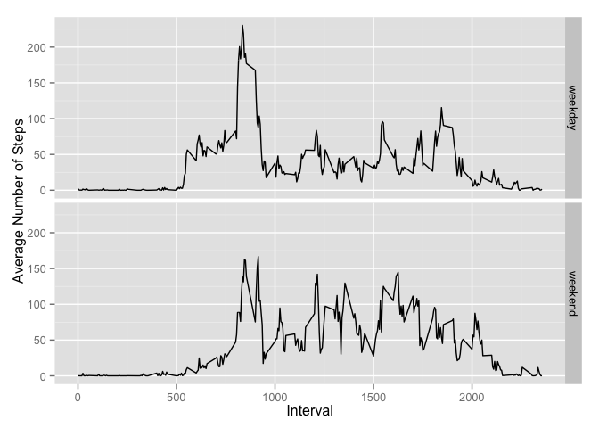

# Reproducible Research: Peer Assessment 1


## Loading and preprocessing the data
### 1. Loading the data
Here I unzip the compressed file then I load it in a dataframe.


```r
unzip("activity.zip")
activities <- read.csv(file = "activity.csv")
```

### 2. Processing/transforming the data
Transform the date column to date format.


```r
activities$date <- as.Date(activities$date)
```

## What is mean total number of steps taken per day?
Need first to load packages required for below tasks

```r
library(dplyr)
library(ggplot2)
```

### 1. Calculating the total number of steps taken per day

```r
sum_act_by_day <- group_by(activities, date) %>%
                    summarize(sum.steps = sum(steps, na.rm = TRUE))
```

### 2. Histogram of the total number of steps taken each day

```r
g <- ggplot(activities, aes(date, steps))
g + geom_histogram(stat = "summary", fun.y = "sum") +
    labs(y="Total Number of Steps", x="Date")
```

```
## Warning: Removed 2304 rows containing missing values (stat_summary).
```

 

### 3. Mean and Median of the total number of steps taken per day

```r
nb_steps_mean <- mean(sum_act_by_day$sum.steps)
nb_steps_median <- median(sum_act_by_day$sum.steps)
```

The mean total number of steps taken per day is: 9354.23

The median total number of steps taken per day is: 10395

## What is the average daily activity pattern?
### 1. Time Series of the Average Number of Steps by Interval of 5-Minutes


```r
g2 <- ggplot(activities, aes(interval, steps))
g2 + geom_line(stat = "summary", fun.y = "mean") +
    labs(y="Average Number of Steps", x="Interval")
```

```
## Warning: Removed 2304 rows containing missing values (stat_summary).
```

 

### 2. The 5-minute interval with the maximum number of steps 

```r
mean_act_by_interval <- group_by(activities, interval) %>%
    summarize(mean.steps = mean(steps, na.rm = TRUE))

mean_act_by_interval[which.max(mean_act_by_interval$mean.steps), "interval"]
```

```
## Source: local data frame [1 x 1]
## 
##   interval
## 1      835
```

## Imputing missing values
### 1. Total Number of Missing Values

Total Number of Missing Steps

```r
sum(is.na(activities$steps))
```

```
## [1] 2304
```

Total Number of Missing Dates

```r
sum(is.na(activities$date))
```

```
## [1] 0
```

Total Number of Missing Intervals

```r
sum(is.na(activities$interval))
```

```
## [1] 0
```

### 2. Devising a strategy for filling in missing values
I will replace the missing values in the dataset with the average number of steps calculated over the dataset for the same 5-minute interval.

### 3. Creating a new dataset while replacing missing values


```r
act_wo_na <- left_join(activities, mean_act_by_interval, by=c("interval" = "interval"))
act_wo_na[which(is.na(act_wo_na$steps)), ]$steps <- 
    act_wo_na[which(is.na(act_wo_na$steps)), ]$mean.steps
```

### 4.1 Histogram of the total number of steps taken each day 


```r
g <- ggplot(act_wo_na, aes(date, steps))
g + geom_histogram(stat = "summary", fun.y = "sum") +
    labs(y="Total Number of Steps", x="Date")
```

 

### 4.2 Mean and Median of the total number of steps taken per day

```r
sum_act_by_day_wo_na <- group_by(act_wo_na, date) %>%
                    summarize(sum.steps = sum(steps, na.rm = TRUE))

nb_steps_mean_wo_na <- mean(sum_act_by_day_wo_na$sum.steps)
nb_steps_median_wo_na <- median(sum_act_by_day_wo_na$sum.steps)
```

The mean total number of steps taken per day (w/o missing values) is: 10766.19

The median total number of steps taken per day (w/o missing values) is: 10766.19

**Mean**<br/>
- with missing values       : 9354.23      
- without missing values    : 10766.19

**Median**<br/>
- with missing values       : 10395     
- without missing values    : 10766.19

**What is the impact of imputing missing data on the estimates of the total daily number of steps?**  
The median value is now equal to the mean value.

## Are there differences in activity patterns between weekdays and weekends?
### 1. Adding new factor variable "weekday"/"weekend"


```r
act_wo_na <- mutate(act_wo_na, day.week = ifelse(weekdays(date) != "Saturday" & weekdays(date) != "Sunday", "weekday", "weekend"))
act_wo_na$day.week <- as.factor(act_wo_na$day.week)
```

### 2. Time series plot by weekday and weekend


```r
g2 <- ggplot(act_wo_na, aes(interval, steps))
g2 + geom_line(stat = "summary", fun.y = "mean") +
    labs(y="Average Number of Steps", x="Interval") + 
    facet_grid(day.week ~ .)
```

 
